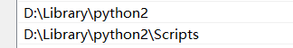
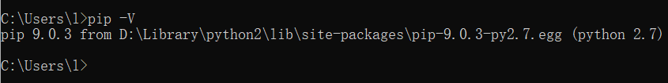

# H4O8ML6E9S.github.io
## 项目创建步骤：

- 前置条件的下载

1. python2的下载！！一定要python2！！



2. 下载pip，最好是**9.x**版本以下的，解压tar.gz文件，进入命令行，输入**<u>python setup.py install</u>** （***此时你的python2下载目录下会出现Script文件夹，把他加入环境变量***）

```
https://files.pythonhosted.org/packages/c4/44/e6b8056b6c8f2bfd1445cc9990f478930d8e3459e9dbf5b8e2d2922d64d3/pip-9.0.3.tar.gz
```

若出现了如下报错：

```
"ImportError: No module named setuptools" 
```

就下载这个，解压tar.gz文件，进入命令行，输入**<u>python setup.py install</u>** 

```
http://pypi.python.org/packages/source/s/setuptools/setuptools-0.6c11.tar.gz
```

3. 输入pip查看是否下载成功了



4. 下载jemdoc库  
   - 由于python2停止维护了，所以就去寻找**<u>jemdoc.py</u>**文件
   - 去[jemdoc官网](http://jemdoc.jaboc.net/download.html)下载jemdoc.py。对的，你没看错，就只要一个.py代码文件就行了。不过建议顺带下载使用官方的[示例CSS文件:jemdoc.css](http://jemdoc.jaboc.net/dist/jemdoc.css)
5. 新建**<u>index.jemdoc</u>**文件,(建议和jemdoc.py同级目录，比较好写命令)

   6.接下来就是生成网页了，这里我并没有将jemdoc添加到环境目录中，所以不能使用官方文档的那种命令方法：

```
jemdoc index.jemdoc
```

- 只能使用普通的python命令，不过也没差多少，这就是没折腾的原因了，python命令如下：

```
python jemdoc.py index.jemdoc
```

- 注意上面是默认你安装的是pyhton2版本的，若是按我的题外话来安装的命令如下：

```
python2 jemdoc.py index.jemdoc
```

6. 生成myMsg.html就可以上传到GitHub了